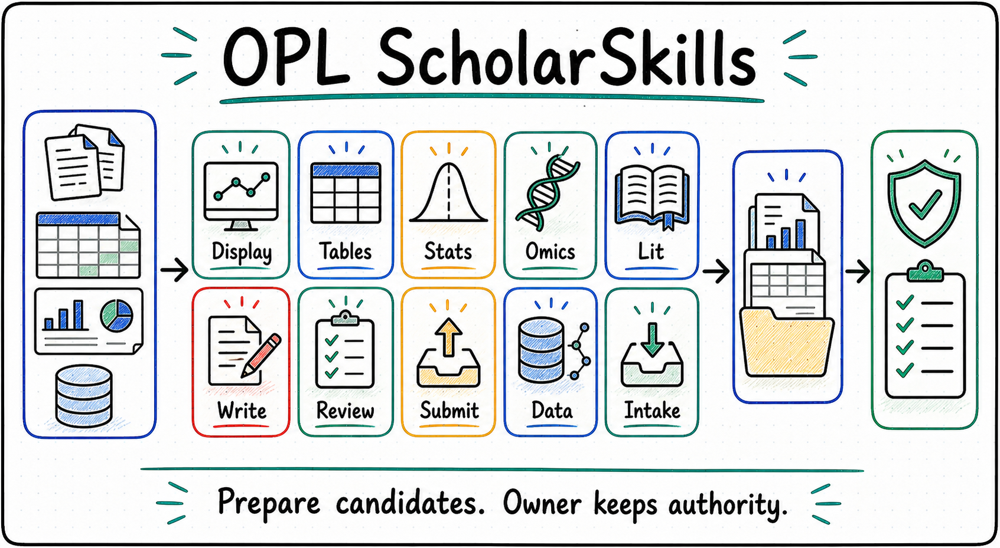

<p align="center">
  
</p>

<p align="center">
  <a href="./README.md">English</a> | <a href="./README.zh-CN.md"><strong>中文</strong></a>
</p>

<h1 align="center">MAS Scholar Skills</h1>

<p align="center"><strong>面向 MAS 医学论文能力的 OPL-owned 外置增强包</strong></p>
<p align="center">图示设计 · 表格整理 · 统计判断 · 文献证据 · 写作修订 · 审阅把关 · 投稿准备 · 数据治理</p>

<!--
Owner: `mas-scholar-skills`
Purpose: `public_repository_entry_zh`
State: `public_entry`
Machine boundary: 人读公开入口。机器真相以 `.codex-plugin/plugin.json`、`skills/mas-scholar-skills/SKILL.md`、`skills/medical-manuscript-writing/SKILL.md`、`skills/medical-manuscript-review/SKILL.md`、`skills/medical-figure-design/SKILL.md`、`skills/medical-figure-style/SKILL.md`、`skills/medical-figure-composer/SKILL.md`、`skills/medical-research-lit/SKILL.md`、`skills/medical-statistical-review/SKILL.md`、`skills/medical-table-design/SKILL.md`、`skills/medical-submission-prep/SKILL.md`、`skills/medical-data-governance/SKILL.md`、`contracts/domain_descriptor.json`、`contracts/capability_map.json`、`contracts/scholar-skills-capability-modules.json`、gallery manifest/fingerprint、OPL Framework CLI readback 与消费方 domain owner receipt 为准。
-->

<p align="center">
  
</p>

`MAS Scholar Skills` 是这个仓库和产品的正式名称：一个由 OPL 持有、Codex 可发现、服务 MAS 医学论文能力的外置增强包。历史 `opl-scholarskills` 只保留为 history / tombstone / provenance，不再作为 active Codex skill。本仓是 MAS Scholar Skills 引用、资料包、质量下限、模板、外部学习吸收、模块合同，`medical-manuscript-writing`、`medical-manuscript-review`、`medical-figure-design`、`medical-figure-style`、`medical-figure-composer`、`medical-research-lit`、`medical-statistical-review`、`medical-table-design`、`medical-submission-prep`、`medical-data-governance` 这些可同步专业技能，以及 4 个可选 router/reviewer skill 和 20 个可选 named-specialty skill 的单源。

aggregate `mas-scholar-skills` Skill 现在有意保持为薄发现与路由入口：它只把模块映射到具体 `medical-*` skill，并保留共用 owner 边界。专业 checklist 留在被选中的 skill，模块和暴露细节留在 contract，安装、CLI、gallery 和运行说明留在 `docs/`，不再让 aggregate 复制每一套工作流。

MAS 的 stage 主提示词留在 MAS domain-agent 仓：canonical stage source 是 MAS `agent/stages/` 和 `agent/prompts/`。MAS overlay Skill、工作区或 quest 内 `.codex/skills/` 同步副本是 Codex discovery projection / 兼容面，不是 stage authority 的源头；这个同步动作本身必须保留，因为 Codex 依靠 `.codex/skills/` 稳定发现本地技能。`write`、`review`、`figure`、`scout` 等阶段负责什么时候进入、证据够不够、交给谁、怎样 route-back、什么算 owner gate。本仓 `medical-*` 技能负责把已经分配下来的写作、审稿、图件、图件风格、图件构图、文献、统计、表格、投稿和临床数据治理任务做得更专业。

简单说：MAS Scholar Skills 负责把“可以帮忙做什么、需要什么材料、会交出什么候选结果、最后由谁确认”讲清楚。公共 owner 边界统一看 [No-Authority Boundary](./docs/no-authority-boundary.md)；机器路由和 false-authority 标记以 `contracts/capability_map.json` 为准。

运行原则是 progress-first 和 AI auto-judgment-first。MAS 不是“AI 只执行、人类才判断”：只要现有证据足够形成候选判断，AI 就应继续给出 AI-consumable evidence、`verdict_candidate`、`route_back_candidate` 和 stop/continue recommendations。只有下一步会越权写入 domain truth、publication readiness、owner receipt、typed blocker，或遇到真实 human gate，才交回 domain owner 或人类。

Display 是其中一个 active 专业模块。MAS Scholar Skills 同时也是 Lit、Tables、Stats、Submit、Write、Review 和 Data Governance 这些学术能力的来源、合同和文档所在地。所有 active 模块共用 refs-only handoff 骨架：`source_pack_ref`、`candidate_refs` 和 `owner_gate_handoff_ref`。这些 ref 只描述候选材料和下一跳 owner gate，不创建运行权威或采纳权威。

当前分层固定为：8 个 active 专业模块，全部由真实可同步 Codex 专业 Skill 支撑。active module id 是 `mas-scholar-skills.display`、`mas-scholar-skills.tables`、`mas-scholar-skills.stats`、`mas-scholar-skills.lit`、`mas-scholar-skills.write`、`mas-scholar-skills.review`、`mas-scholar-skills.submit` 和 `mas-scholar-skills.data`；历史 `opl.scholarskills.*` id 只保留为 legacy alias/provenance。`medical-manuscript-writing`、`medical-manuscript-review`、`medical-figure-design`、`medical-figure-style`、`medical-figure-composer`、`medical-research-lit`、`medical-statistical-review`、`medical-table-design`、`medical-submission-prep`、`medical-data-governance` 是可同步 skill source；其中 `medical-figure-style` 和 `medical-figure-composer` 是 `display` 下的薄子能力，不新增 active module。默认 Codex 暴露只应是 workspace / quest compact install：aggregate `mas-scholar-skills` 加这些 core skills。可选专科 Skill 只在 named specialty scope 同步；`opl-scholarskills` 没有 active `SKILL.md`。通用 source / external-learning intake 归 OPL Framework 或 MAS stage/source surface，不在本仓保留合同占位；组学能力等 MAS 有稳定真实专业 workflow 时，再作为真实专业 Skill 进入本仓。

三层语义固定为：专业 Skill 负责医学判断、playbook、rubric、route-back 和候选 refs；Skill-local deterministic helper 随 Skill 同目录分发，通常是 `kernel.py`，只做解析、归一化、lint、skeleton、manifest / receipt shaping 或 self-check；程序化基座和 authority surface 归 MAS / OPL Framework，负责 connector、credential、runtime、receipt、owner gate、artifact authority、publication readiness 和 App/operator projection。本仓可以维护前两层的 source 和 refs，但不持有 MAS domain truth、owner receipt、typed blocker、runtime queue、provider lifecycle 或 publication/export readiness。

文献工作由真实 AI-first 专业 Skill `medical-research-lit` 承接。PubMed/PMC 仍是生物医学来源优先路径，通过 MAS `research-integrity-reference-verification` 获取 `mas_provider_lookup_ref` 和 `pubmed_source_refs` 这类非权威 evidence input。Crossref 和 OpenAlex 只在 metadata、coverage 或 citation graph fallback 需要时作为 OPL Connect 候选 refs 使用，不代表 citation acceptance。`medical-research-lit` 负责 query strategy、来源筛选、fallback reason、`claim_support_map_ref` 和 `owner_gate_handoff_ref`；MAS 负责 provider lookup、citation acceptance 和 manuscript use。

当前专业质量地板放在真实 Skill 内维护。共享交接形状见
[`references/professional-quality-ref-templates.md`](./references/professional-quality-ref-templates.md)，
让每个 `medical-*` skill 指向公共 refs，而不是复制长 checklist。
MAS journal-family pack refs 也通过同一引用回折到现有 `medical-*` skill；
它们是路由 hint，不是新增物理 skill，也不是 MAS authority surface。

可选 named-specialty 工作收敛到 4 个 router/reviewer Skill：
`medical-methodology-planner`、`medical-evidence-integrity-reviewer`、
`medical-publication-routeback-reviewer` 和 `medical-advanced-biomed-router`。
它们是真实可发现 Codex Skill，但只提供 refs-only / no-authority 候选帮助；
不替代默认医学论文技能，不成为 MAS authority owner，缺失时也不阻断 MAS
ordinary progress。

20 个更窄的 optional specialist，例如 `medical-structural-biology`、
`medical-protocol-and-sap-planner`、`medical-reference-integrity-auditor`、
`medical-display-qc` 和 `scientific-compute-runner`，仍保留为真实
named-specialty `SKILL.md` playbook。它们不应默认安装；只有明确专科任务
或 router 选中时，才由 OPL Connect 按需同步一个具体 skill。

4 个原本独立的 optional professional skill 现在是 reviewer mode，不再是
独立 Codex metadata：evidence-gap triage 由
`medical-evidence-integrity-reviewer` 覆盖；methodology routeback 和
owner-gate handoff 由 `medical-publication-routeback-reviewer` 覆盖；
publication strategy memory 由 `medical-research-portfolio-memory-curator`
覆盖。对应退役目录只保留 `TOMBSTONE.md` redirect 记录。

<table>
  <tr>
    <td width="33%" valign="top">
      <strong>服务对象</strong><br/>
      需要 OPL-owned 增强材料的 MAS overlay 会话与 MAS 医学论文技能
    </td>
    <td width="33%" valign="top">
      <strong>解决问题</strong><br/>
      把 MAS Scholar Skills 引用、资料包、质量下限、外部学习模式和模块合同收成一个单源
    </td>
    <td width="33%" valign="top">
      <strong>交付形态</strong><br/>
      提供候选引用、模板、quality-floor 提示、图表示例和交接包；不替代 MAS owner authority
    </td>
  </tr>
</table>

## 为什么需要 MAS Scholar Skills

学术工作不是一次生成就结束。一个课题通常会反复经历材料接入、数据理解、统计检查、图表设计、文献组织、文字修订、内部审阅和投稿准备。每一步都需要专业判断，能够复用的专业能力应该有稳定单源，而不是散落成临时提示词。

MAS Scholar Skills 的设计目标是把这些可复用支持材料变成 active 专业模块和可同步专家 Skill：

- MAS overlay 和 MAS medical-research skills 可以按同一套语言请求图示、表格、统计、文献、写作、审阅、投稿或数据治理支持。
- 每个模块都说明适合处理什么材料、会产出什么候选结果、需要哪些审阅。
- `medical-manuscript-writing`、`medical-manuscript-review`、`medical-figure-design`、`medical-figure-style`、`medical-figure-composer`、`medical-research-lit`、`medical-statistical-review`、`medical-table-design`、`medical-submission-prep`、`medical-data-governance` 都是本 source repo 的真实 Codex Skill，不只是模块 descriptor、plugin mirror 或 connector descriptor。
- 可选 advanced 和 medical-method specialist skills 也是真实 Codex discovery skills，但不属于八个 active 专业模块，只在明确专科任务中使用。
- `opl-scholarskills` 只保留为 tombstone/provenance alias，不再安装或发现为 active Codex skill。
- Source / external-learning intake 归 OPL Framework 或 MAS stage/source surface，不作为本仓 active module 或合同占位；未来组学支持只有在 MAS 形成稳定专业 workflow 后，才作为真实专业 Skill 加入本仓。
- 默认情况下，professional specialist skill 应放在消费它的 domain-agent 仓、贴近 stage 主提示词；只有重型、跨 workspace 复用或需要独立发布/同步时，才拆到外部 pack。本仓就是 MAS 写作、审阅、图件、文献、统计、表格、投稿、Display/source refs 的外部 pack 单源。
- 候选结果可以进入后续人工或领域智能体审阅，但不能自动升级为论文事实。
- 同一个能力包可以同步到不同 MAS 工作区或 quest，而不复制第二套 source of truth。OPL plugin install 和 MAS mirror 只是这个仓库的 sync/discovery projection，不是第二套 skill source。

这种设计让学术能力可以被复用，也让权责边界保持清楚：能力模块负责准备和交接，领域负责人负责采纳和定稿。共同的 refs-only / no-authority 规则见 [No-Authority Boundary](./docs/no-authority-boundary.md)，各模块不再重复展开同一套边界清单。

## Active 专业模块

| 模块 | 用途 |
| --- | --- |
| **学术图示** | 帮助整理图意图、图表结构、视觉模板和人审图库，让研究结果更容易被看懂。 |
| **论文表格** | 为基线表、统计摘要表、结果表和表格质检提供候选结构。 |
| **统计判断** | 帮助组织分析方案、模型选择、可重复性检查和统计结果说明。 |
| **文献证据** | 帮助建立文献地图、引用清单、证据链和已有研究对照。 |
| **写作修订** | 支持摘要、引言、方法、结果、讨论等论文段落的候选草稿与来源追踪。 |
| **审阅把关** | 形成审阅报告、返修建议、route-back 证据和下一步修改入口。 |
| **投稿准备** | 整理投稿包、清单、格式要求和提交前检查材料。 |
| **数据脉络** | 记录数据来源、处理路线、变量说明、血缘关系、存储分层、派生副本盘点、restore-proof retention、已完成项目 closeout、lifecycle catalog 和可复核性线索。 |

这些模块不是独立产品，也不是与 MAS stage 主提示词并列的默认入口。它们是 MAS 可发现和调用的增强能力地图。真正的图表、论文、分析结论、审稿决策和投稿动作，仍由对应的 MAS/domain 系统和负责人确认。

## 外部学习模块映射

ARS、PaperOrchestra、Research-Paper-Writing-Skills、Paperlib、SciPilot Figure、NaturePanelForge、Marsilea 以及科研图示/资源清单里的可迁移做法，只进入 MAS Scholar Skills 的 refs-only 模块映射。落点是八个 active 模块更强的候选引用和检查清单，而不是引入第二套外部 runtime 或 truth source。

专业 Skill 质量地板也吸收 `K-Dense-AI/scientific-agent-skills` 和 `Yuan1z0825/nature-skills` 中可维护的模式：可发现科研技能包、图件契约、schematic 边界、先论证后写作、审稿事实基座、批判性思维与 scholar-evaluation 检查、来源路由与引用核验、检索契约、绘图和导出质检、EDA / model specification 纪律、统计效能与实验设计纪律、期刊指南映射、临床表格纪律、数据可用性检查、数据库来源记录和审稿回复纪律。这些模式会进入 MAS 消费的专业 Skill，而不是作为第二套 runtime 引入。

轻量模板入口见 [`references/professional-quality-ref-templates.md`](./references/professional-quality-ref-templates.md)：图件使用 `figure_contract_template_ref` / `panel_evidence_chain_ref`，文献使用 `source_ref_chain_template_ref` / `source_acceptance_decision_ref`，写作与审阅共用 `claim_citation_quality_loop_ref` / `citation_quality_action_matrix_ref`，全部保持 refs-only、no-authority。

这些优化优先进度：智能体不需要先安装外部 runtime 才能继续推进。它们增加的是可审阅候选面，例如视觉 QA 预览、引用核查、claim-evidence map、投稿 sanity refs、数据 lineage 和 lifecycle refs；不能绕过 MAS 或其他领域负责人的 owner gate。

K-Dense 专项吸收映射记录在 [K-Dense intake 文档](./docs/kdense-scientific-agent-skills-intake.md)，说明哪些模式已落到真实医学专业 Skill，哪些生物医学专科能力通过 OPL Connect 保持按需发现，哪些外部默认保持拒绝。

## 默认边界防线

新增或争议中的 MAS Scholar Skills 能力，默认指向
[No-Authority Boundary](./docs/no-authority-boundary.md)：Stage prompt
来源（`agent/stages/`、`agent/prompts/`）持有 MAS 权威，Professional
specialist skill 只持有 refs-only 候选 playbook，Tool connector 持有只读访问回执，
contract module 持有 id/ref 词汇。`opl-scholarskills` 仍只是 history/tombstone/provenance 名称。

## 一句话使用方式

你可以直接这样让 Codex 或 OPL 智能体调用它：

- “在 MAS overlay 里以 `medical-figure-design` 为主入口，拉取 MAS Scholar Skills Display refs 形成图件候选包；不要声明 publication readiness。”
- “让 MAS medical-research skills 使用 MAS Scholar Skills Display、Tables、Stats refs，列出下一步最该补的候选材料。”
- “把当前文献证据、写作缺口和投稿准备事项整理成 refs-only MAS 交接清单。”

## 当前包含的审阅样例

本仓随包提供一个医学图示图库，方便用户和操作者直接查看 Scholar Display 的当前视觉样例。它是人审参考包，不是论文发表授权。

- [`gallery/medical-display/medical_display_gallery.pdf`](./gallery/medical-display/medical_display_gallery.pdf)
- [`gallery/medical-display/medical_display_gallery_reference.md`](./gallery/medical-display/medical_display_gallery_reference.md)
- [`gallery/medical-display/display_pack_gallery_status.md`](./gallery/medical-display/display_pack_gallery_status.md)
- [`gallery/medical-display/display_pack_gallery_quality_audit.md`](./gallery/medical-display/display_pack_gallery_quality_audit.md)
- [`gallery/medical-display/gallery_manifest.json`](./gallery/medical-display/gallery_manifest.json)
- [`gallery/medical-display/gallery_snapshot.json`](./gallery/medical-display/gallery_snapshot.json)

图库只保存最终人审包。渲染中间结果、单图导出、缓存、版式旁路文件和依赖锁不进入本仓。

## 当前边界

- `MAS Scholar Skills` 是本仓和增强包的正式名称，不是通用 OPL 基座，也不是 MAS/MAG/RCA 的领域真相源。
- 本仓维护可分发的 Codex 插件和技能入口、MAS 消费的医学写作/审阅/图件/文献/统计/表格/投稿/数据治理专业 skill、八模块 active 目录、图库人审包和说明文档。
- OPL Framework 维护可执行命令、同步、运行环境桥接、Connect/Fabric 资源能力和工作台动作。
- MAS overlay 仍是 runtime owner 入口。MAS 在本仓外维护 stage 主提示词，并从本仓消费可同步 `medical-*` 专业 skill。
- MAS Scholar Skills 的输出只能作为候选引用、候选包或审阅提示；[No-Authority Boundary](./docs/no-authority-boundary.md) 是公共 owner 边界引用，`contracts/capability_map.json` 是机器可读路由和 false-authority 来源。

<details>
  <summary><strong>给技术操作者看的入口</strong></summary>

### 仓库结构

```text
.codex-plugin/plugin.json              Codex plugin manifest
skills/mas-scholar-skills/SKILL.md     canonical Codex skill entry
skills/medical-manuscript-writing/SKILL.md 医学论文写作专业 skill
skills/medical-manuscript-review/SKILL.md 医学论文审阅专业 skill
skills/medical-figure-design/SKILL.md 医学论文图件设计专业 skill
skills/medical-figure-style/SKILL.md 医学图件风格 QA 子 skill
skills/medical-figure-composer/SKILL.md 医学多面板组合子 skill
skills/medical-research-lit/SKILL.md   文献检索专家 Skill
skills/medical-statistical-review/SKILL.md 医学统计审阅专业 Skill
skills/medical-table-design/SKILL.md   医学表格设计专业 Skill
skills/medical-submission-prep/SKILL.md 医学投稿准备专业 Skill
skills/medical-data-governance/SKILL.md 医学数据治理专业 Skill
skills/medical-methodology-planner/SKILL.md 可选 methodology router Skill
skills/medical-evidence-integrity-reviewer/SKILL.md 可选 evidence integrity reviewer Skill
skills/medical-publication-routeback-reviewer/SKILL.md 可选 publication route-back reviewer Skill
skills/medical-advanced-biomed-router/SKILL.md 可选 advanced biomed router Skill
contracts/scholar-skills-capability-modules.json Codex 暴露策略与模块合同
contracts/domain_descriptor.json       OMA target descriptor
contracts/capability_map.json          OMA capability target map
contracts/                             module catalog snapshot
gallery/medical-display/               紧凑人审 gallery package
docs/                                  capability 与运维说明
scripts/verify.sh                      仓库验证入口
```

### 同步到工作区或任务

推荐消费面是论文工作区或运行任务内的本地 Codex 发现副本：

```text
<workspace_root>/.codex/skills/mas-scholar-skills/
<workspace_root>/.codex/skills/medical-manuscript-writing/
<workspace_root>/.codex/skills/medical-manuscript-review/
<workspace_root>/.codex/skills/medical-figure-design/
<workspace_root>/.codex/skills/medical-figure-style/
<workspace_root>/.codex/skills/medical-figure-composer/
<workspace_root>/.codex/skills/medical-research-lit/
<workspace_root>/.codex/skills/medical-statistical-review/
<workspace_root>/.codex/skills/medical-table-design/
<workspace_root>/.codex/skills/medical-submission-prep/
<workspace_root>/.codex/skills/medical-data-governance/
<quest_root>/.codex/skills/mas-scholar-skills/
<quest_root>/.codex/skills/medical-manuscript-writing/
<quest_root>/.codex/skills/medical-manuscript-review/
<quest_root>/.codex/skills/medical-figure-design/
<quest_root>/.codex/skills/medical-figure-style/
<quest_root>/.codex/skills/medical-figure-composer/
<quest_root>/.codex/skills/medical-research-lit/
<quest_root>/.codex/skills/medical-statistical-review/
<quest_root>/.codex/skills/medical-table-design/
<quest_root>/.codex/skills/medical-submission-prep/
<quest_root>/.codex/skills/medical-data-governance/
```

使用当前 OPL Framework checkout 的 Connect：

```bash
opl connect sync-skills --domain mas-scholar-skills --scope workspace --target-workspace <workspace_root> --json
opl connect sync-skills --domain mas-scholar-skills --scope quest --target-quest <quest_root> --json
```

目标目录只应收到 aggregate skill、核心医学论文 Skill、插件/模块引用与紧凑图库审阅引用。可选专科 Skill 只在明确 named specialty 任务中同步。不要把本仓整仓、MAS `outputs/display-pack-gallery/`、渲染缓存、单图导出、依赖锁或图库中间产物复制进每个论文工作区或任务目录。

### 常用读取检查

```bash
opl connect skills --domain mas-scholar-skills --json
opl connect sync-skills --domain mas-scholar-skills --scope workspace --target-workspace <workspace_root> --json
```

单独克隆本仓不会安装 OPL Framework 的可执行面。需要 package descriptor readback 或显式 skill sync 时，应准备当前 `one-person-lab` 检出仓库或发布包。本包不再暴露 module execution CLI。

</details>

## 验证

```bash
scripts/verify.sh
```

验证脚本会检查插件清单、技能入口、模块目录、图库包、无权威边界、忽略中间产物策略和图库产物指纹。

## 继续阅读

- [Capability Modules](./docs/capability-modules.md)
- [No-Authority Boundary](./docs/no-authority-boundary.md)
- [MAS Scholar Skills Operating Model](./docs/mas-scholar-skills-operating-model.md)
- [Candidate Artifact Engines](./docs/candidate-artifact-engines.md)
- [Academic Figure Skill Learning Landing](./docs/academic-figure-skill-landing.md)
- [Display Gallery](./docs/gallery/display-gallery.md)
- [Gallery Snapshot](./gallery/medical-display/gallery_snapshot.json)
